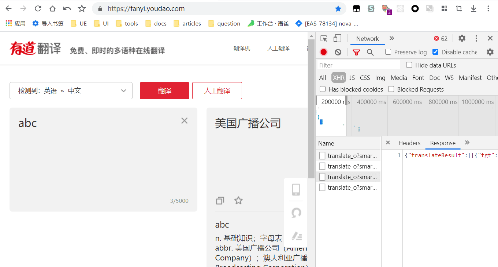

# Easy Interceptor

中文 | [English](./readme.md)

## 摘要
Easy Interceptor是一个chrome插件，它可以拦截XMLHttpRequest数据请求方式的http请求，通过覆盖response，responseText字段达到对数据的拦截和修改，多用于调试web页面。

> 注意：它并不会修改原始的请求，因此devtool-network的信息不会改变

## 使用说明

### 图标状态
- 灰色：关闭状态
- 橙色：监听状态
- 紫色：拦截状态

### 左上方工具栏
- 【新增】：添加一条数据
- 【删除】：删除
- 【导入、导出】：对当前工程的序列化
- 【刷新】：刷新数据
- 【切换主题】：亮色模式 | 暗色模式

### 右上角菜单
- 关闭状态：关闭插件
- 监听功能：监听请求（仅对Content-Type为json类型的请求有效）
- 拦截功能：自定义responseText

### 如何使用

**方式1**：新建一个数据然后手动填写general和response选项，如下

**方式2**：使用监听形式，重新请求接口，然后修改数据

**方式3**：使用监听形式，控制台replay，然后修改数据（注意：使用此方式无法获取response，需要手动填写）

### 注意事项
- 仅在开发时使用，不使用时请关闭
- 因为存储仅有5M，插件使用shorten函数对单条数据做精简（规则：数据超过50000字符时启用，当满足数组超过10项或字符串超过200字符时会通过递归折半精简数据）
- 你可以书写js对象，程序会尝试修复，如下

