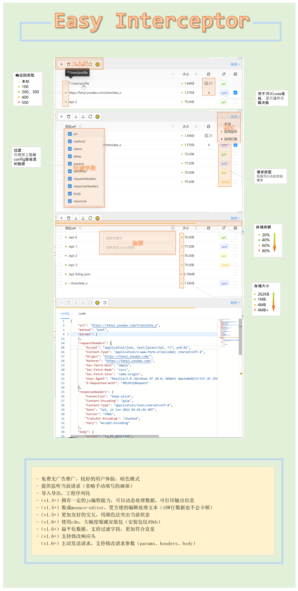
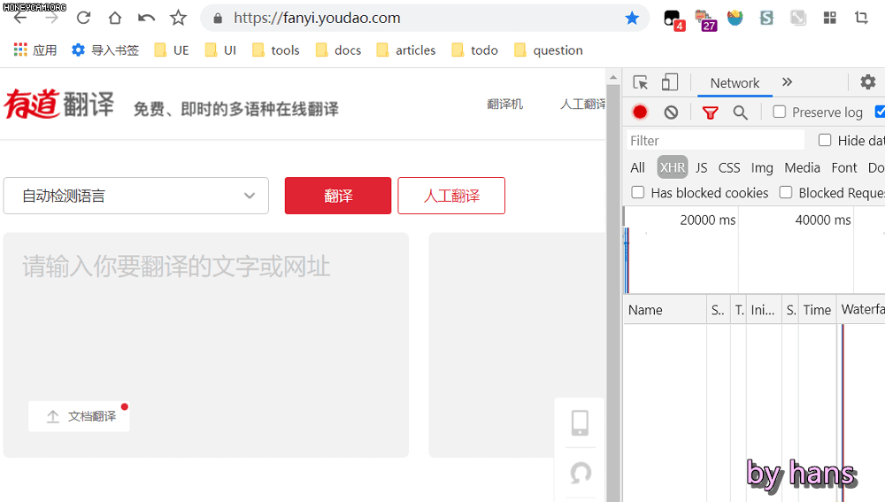
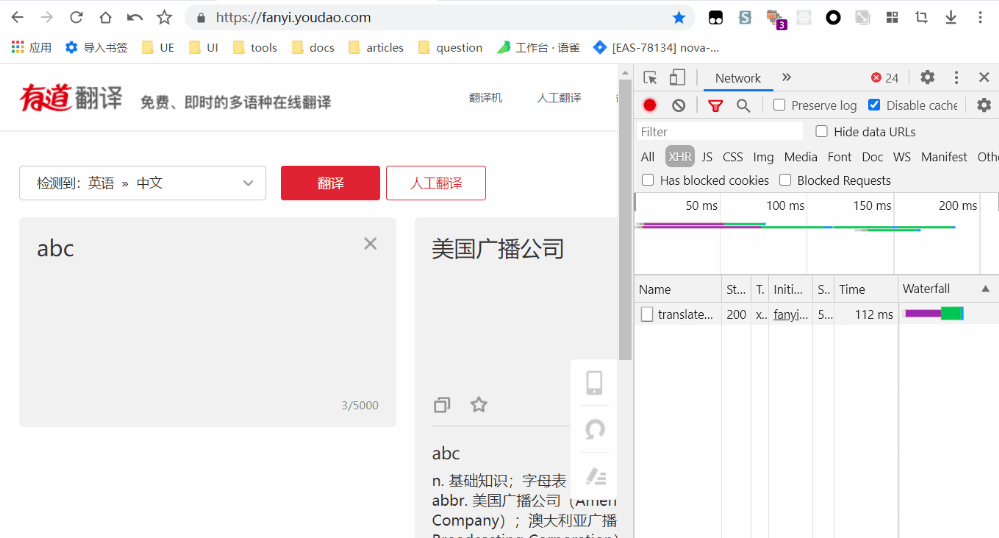
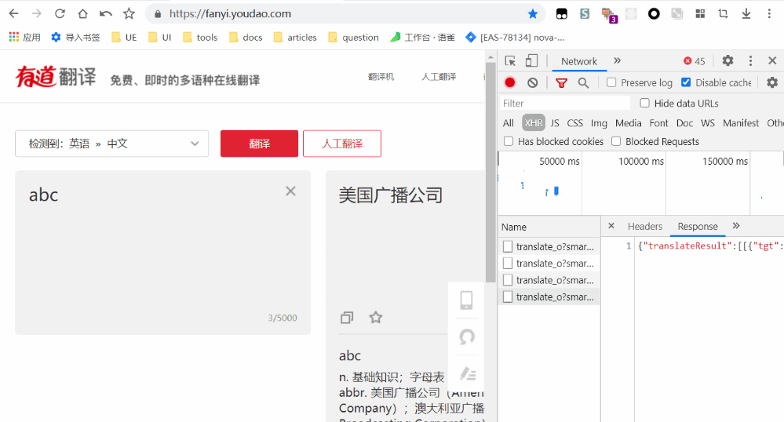
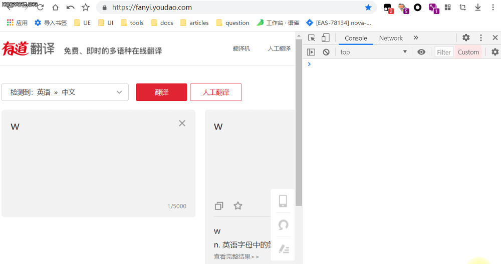

# Easy Interceptor

中文 | [**English**](./readme.md)

## 摘要
相信多数前端都会遇到这类问题：明明是要验证一个很简单的东西，但是这个问题复现的前置条件实在**太难**完成了，导致自己很痛苦。这里的太难完成可能是：

- 业务流程太长（不熟悉流程或不想重走一遍）
- 要验证的是测试环境，不能通过前端硬编码解决
- 修改数据库困难（没有条件改、不会改或者不想麻烦后端改）
- 不想使用代理软件（没必要、没用过或者安装、配置麻烦等）

如何解决上述问题呢？如果可以在客户端接收数据前拦截并加以修改再返回，就可以达到mock数据的目的。Easy Interceptor就是利用上述思路，作为一个chrome插件，它对使用者的心智负担极小，它可以拦截XMLHttpRequest，fetch数据请求方式的http请求，达到对数据的修改。不过具体的处理会有所不同：

- xhr: 内部实现了一个假的XMLHttpRequest，因此使用xhr类型的请求方式不会向后端发出请求，也无须后端服务支持

- fetch: 通过代理其上的方法、属性，覆盖特定的字段，因此无法配置delay、status字段，还是会发出请求，需要保证接口正常才能生效，并且也不会改变devtool-network的信息

> 注意：插件仅针对content-type: json类型有效

## 特点

- 免费，无广告推广
- 提供监听当前请求（省略填写的麻烦）
- 集成monaco-editor，更方便的编辑处理文本（10W行数据也不会卡顿）
- 导入导出，工程序列化
- 更加友好的交互，用颜色法突出当前状态
- 拥有一定的js编程能力，可以动态处理数据

## 使用说明

    
老版本使用说明（v1.4之前）

    

    
### 图标状态
- 灰色：关闭状态
- 橙色：监听状态
- 紫色：拦截状态

### 左上方工具栏
- 【新增】：添加一条数据
- 【删除】：删除
- 【导入、导出】：对当前工程的序列化
- 【刷新】：刷新数据
- 【切换主题】：亮色模式 | 暗色模式

### 右上角菜单
- 关闭状态：关闭插件
- 监听功能：监听请求（仅对Content-Type为json类型的请求有效）
- 拦截功能：自定义responseText

### 如何使用

**方式1**：新建一个数据然后手动填写general和response选项，如下

**方式2**：使用监听形式，重新请求接口，然后修改数据

**方式3**：使用监听形式，控制台replay，然后修改数据（注意：使用此方式无法获取response，需要手动填写）

**方式4**：可以在code面板中定义一个匿名函数用于转换数据，(response, config) => response

### 注意事项
- 仅在开发时使用，不使用时请关闭
- 因为存储仅有5M，插件使用shorten函数对单条数据做精简（规则：数据超过50000字符时启用，当满足数组超过10项或字符串超过200字符时会通过递归折半精简数据）
- 你可以书写js对象，程序会尝试修复，如下

