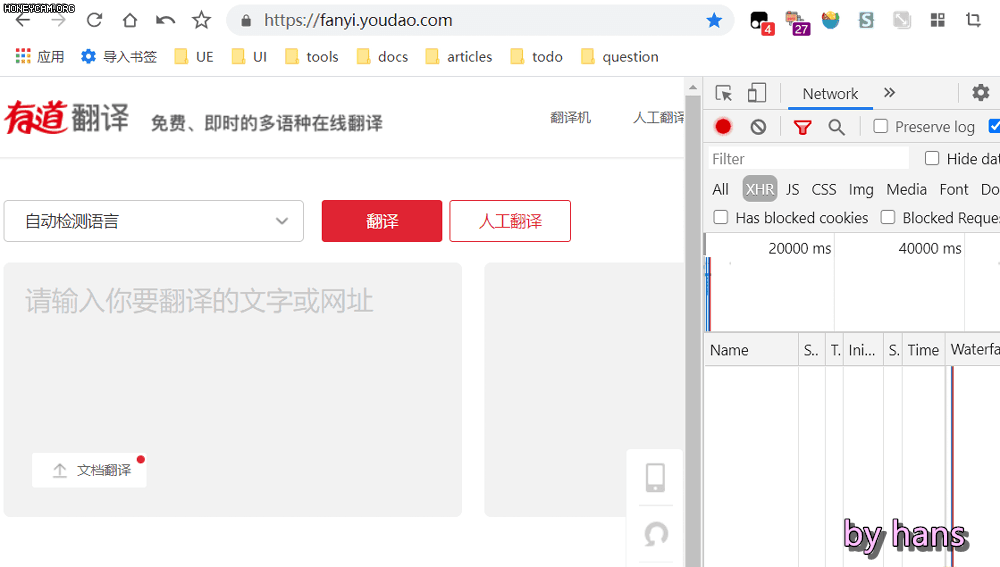
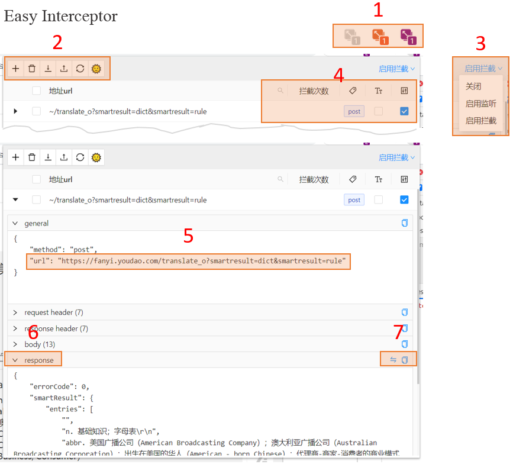
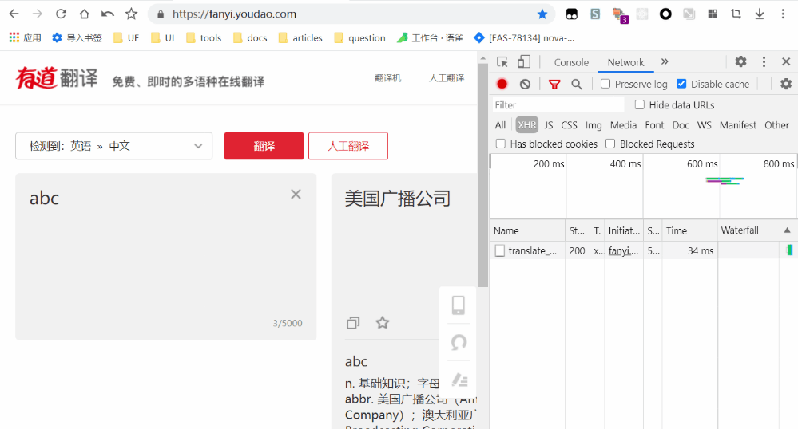
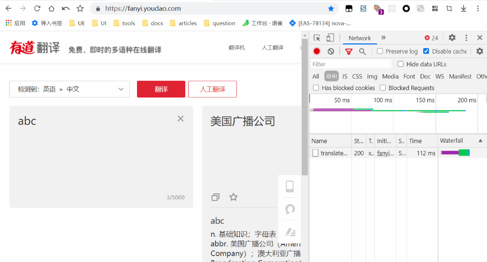
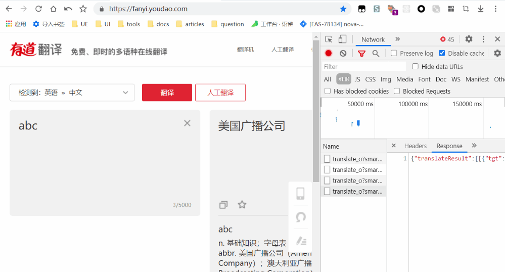
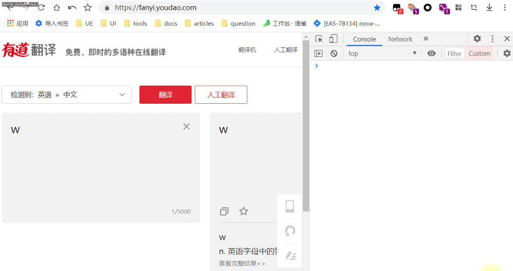
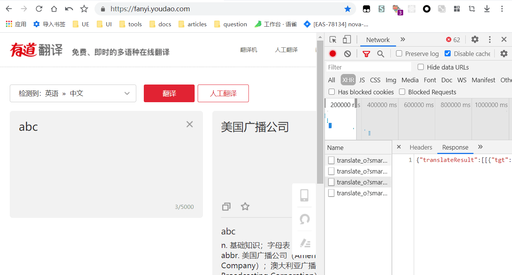

# Easy Interceptor

中文 | [**English**](./readme-EN.md)

## 📑 摘要
一款集成了模拟和拦截请求并拥有一定编程能力的谷歌浏览器插件，其中存储容量、大小用颜色做了指示，界面简洁，交互友好。由于对项目没有依赖性、侵入性，所以开发、测试、生产环境都适用。


## 🚀 使用场景
设想一下明明是要验证一个很简单的东西，但是这个问题复现的前置条件实在太难完成了，导致自己很痛苦。这里的太难完成可能是：

- 业务流程太长（不熟悉流程或不想重走一遍）
- 要验证的是测试环境，不能通过前端硬编码解决
- 修改数据库困难（没有条件改、不会改或者不想麻烦后端改）
- 不想使用代理软件（没必要、没用过或者安装、配置麻烦等）

如何解决上述问题呢？如果可以在客户端接收数据前拦截并加以修改再返回就可以达到目的。Easy Interceptor就是利用上述思路，它可以拦截XMLHttpRequest，fetch数据请求方式的http请求，通过覆盖response，responseText字段，从而达到对数据的修改。作为一个chrome插件，天然的集成在用户测试环境，因此对使用者的心智负担极小。

- xhr: 内部实现了一个FakeXMLHttpRequest，因此使用xhr类型的请求方式可以不向后端发出请求，也无须后端服务支持

- fetch: 内部实现了一个fakeFetch

> 注意：
> 
> 插件仅针对content-type: json类型有效，在不用时请关闭该插件防止出现页面加载异常
>
> 如果你是一个熟练度拉满，有着完善的代理环境大可不必使用，仅作为特定场合的补充
> 
> 如果使用cdn版本，请保证能访问unpkg.com，首次加载会比较慢。或者直接使用local版本

## 🎉 特点

- 免费无广告推广，较好的用户体验，暗色模式
- 提供监听当前请求（省略手动填写的麻烦）
- 导入导出，工程序列化
- 拥有一定的js编程能力，可以动态处理数据，可打印输出信息
- 集成monaco-editor，更方便的编辑处理文本（10W行数据也不会卡顿）
- 更加友好的交互，用颜色法突出当前状态
- 使用cdn，大幅度缩减安装包
- 扁平化数据，支持过滤字段，更加符合直觉
- 支持修改响应头
- 主动发送请求，支持修改请求参数（params、headers、body）
- fake模式，用于适应不同的场景需求（默认关闭，部分场景下fake模式可能会失效）

## 📑 使用说明

> 部分操作查看老版本使用说明

### 图标状态
- 灰色：关闭状态（数字角标展示当前列表共有多少条数据）
- 橙色：监听状态（数字角标展示当前列表共有多少条数据）
- 紫色：拦截状态（数字角标展示当前列表共启用拦截多少条数据）
- 黑色：拦截状态-Fake模式（数字角标展示当前列表共启用拦截多少条数据）

### 左上方工具栏
- 【新增】：添加一条数据
- 【删除】：删除
- 【导入、导出】：对当前工程的序列化
- 【刷新】：刷新数据
- 【切换主题】：亮色模式 | 暗色模式
- 【fake模式】：是否启用fake，默认关闭，仅对请求进行拦截，依赖后端服务；开启后会使用一个模拟的对象，可以不依赖后端服务

### 右上角菜单
- 关闭状态：关闭插件
- 监听功能：监听请求（仅对Content-Type为json类型的请求有效）
- 拦截功能：自定义responseText

### config面板

|属性|类型|说明|
|---|---|---|
|url|string|必选，请求地址|
|test|string|必选，匹配的请求地址，ant-path-matcher规则|
|type|xhr\|fetch|请求类型，默认xhr|
|response|object\|array\|null\boolean\|number|响应数据|
|responseText|string|响应数据|
|delay|number|延迟的毫秒数|
|method|enum get\|put\|post\|delete\|patch|请求类型|
|body|Record<string, any>|请求主体|
|status|number|默认200|
|params|[string, string][]||
|requestHeaders|Record<string, string>|请求头|
|responseHeaders|Record<string, string>|响应头|
|redirectUrl|string|重定向链接，不能和url一样，会死循环|

### code面板
通过定义\_\_map\_\_来动态的修改数据
```
function __map__(data, inst: XMLHttpRequest | Response) {
    return {
        // 内部会做一个shallow merge
        response: {
            foo: Math.random().toString()
        }
    }
}
```


## ⭐ 使用场景

### 拦截数据

选择拦截模式，勾选需要拦截的接口，刷新页面即可

> 注意：
>
> 使用response或responseText来覆盖真实值
> 
> 如果需要延迟接口响应可以使用delay字段

### 测试后端接口

插件提供了测试后端接口的功能，你可以理解为是一个简单的postman，由于插件端不存在跨域的问题，因此无需代理，设置好相应的请求头即可。

> 注意：确保是一个完整的url（可以从请求类型表框是否为实线看出）


## 📜 后期计划

- ⚪ 支持indexeddb
- ⚪ 支持通过cdn来增强code面板
- ⚪ 使用v3版本（chrome88+）
- ⚪ 支持环境变量等
- ⚪ 支持本地化


## 💬 Q&A

### 🔹 为什么会有两个安装包
推荐使用cdn版本，带local字眼的为离线版，适合内网用户


### 🔹 为什么插件窗口只有800x600
这个是由于浏览器限制的，popup的形式最大支持800x600，该形式的好处在于尽可能不影响项目本身（不足在于每次都会重新加载页面，因此插件做了很多的序列化以保证较好的用户体验）


### 🔹 存储只有5M，如何突破限制
主要response数据量太大导致的，可以把response面板设置为 `null` , code面板通过js修改数据（未来会加入indexeddb）


### 🔹 为什么是262kb
这里是为了方便写程序，y = f(x) = log2(x)，取了个公差为2的等差数列18 20 22；也就是2^18 = 262144，并且这些值也比较合适。


### 🔹 为什么仅支持json类型的请求
起初是为了解决自测阶段部分场景的复现问题（现在的应用前后端交互基本都是json类型），期间使用了几个类似的插件发现用户体验不是很好，一些代理软件功能很强，但是个人也不太喜欢太重的配置，使用的环境要尽可能单一。如果无法满足您的个人需要可以pr或fork


## 📑 老版本使用说明
> 强烈建议使用最新版本
<details>
    <summary>（v1.5）展开 / 折叠</summary>

</details>

<details>
    <summary>（v1.4之前）展开 / 折叠</summary>
    


### 如何使用

**方式1**：新建一个数据然后手动填写general和response选项，如下



**方式2**：使用监听形式，重新请求接口，然后修改数据



**方式3**：使用监听形式，控制台replay，然后修改数据（注意：使用此方式无法获取response，需要手动填写）



**方式4**：可以在code面板中定义一个匿名函数用于转换数据，(response, config) => response



### 注意事项
- 仅在开发时使用，不使用时请关闭
- 因为存储仅有5M，插件使用shorten函数对单条数据做精简（规则：数据超过50000字符时启用，当满足数组超过10项或字符串超过200字符时会通过递归折半精简数据）
- 你可以书写js对象，程序会尝试修复，如下


</details>

## License
[MIT](./LICENSE)