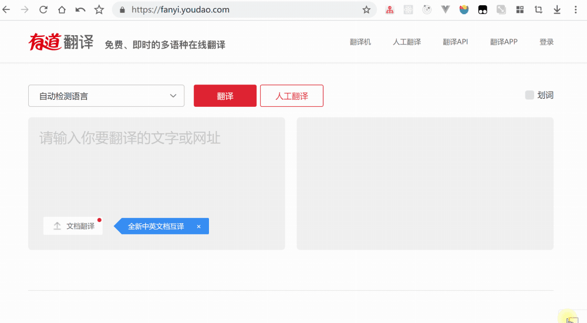

# Easy Interceptor

[中文](./readme-zh.md) | English

## abstract
Easy Interceptor is a Chrome extension that intercepts HTTP requests in the form of XMLHttpRequest data requests. It intercepts and modifs data by overwriting the Response and responseText fields. It is mainly used for debugging Web pages.

## usage

### icon status
- gray: close status
- orange: watching status
- purple: intercepting status

### top-left tool
- [add]: add a item
- [remove]: remove a item
- [import export]: serialization function
- [refresh]: refresh data
- [toggle theme]: support light and dark

### top-right tool
- close: close extension
- watch: Intercepts a request whose current content-Type is JSON
- intercept: custom responseText

## tips
- Just keep running in development
- Because the storage is only 5M, the extension uses the shorten function to simplify the data. (rules: Enable algorithm when data exceeds 50,000 characters. Refine data by recursive halving when an array of more than 10 items or a string of more than 200 characters is satisfied)